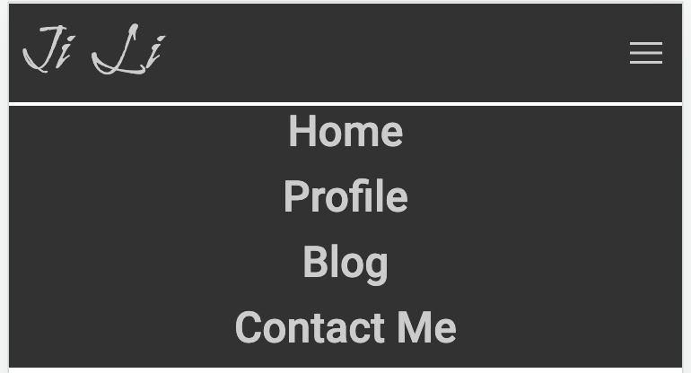
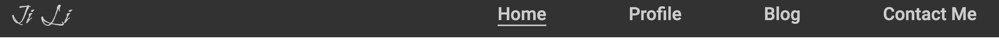
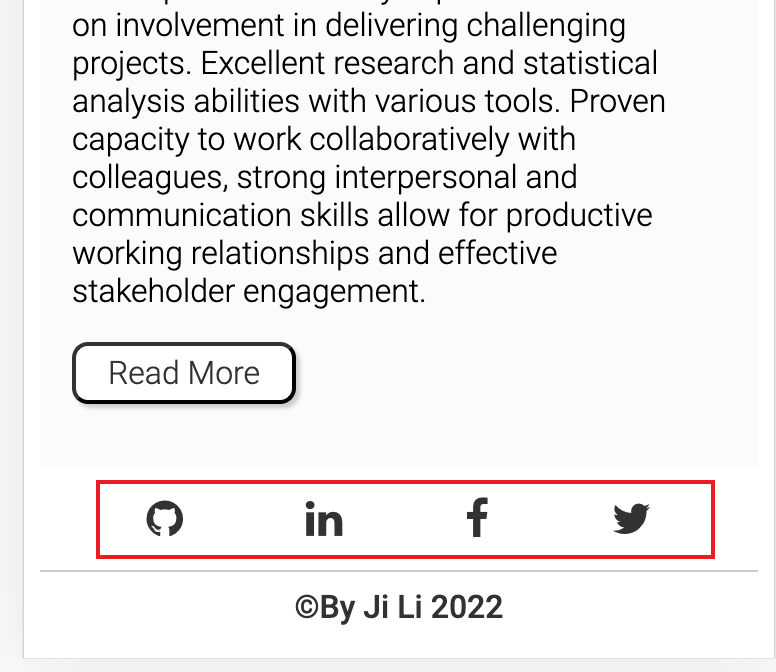
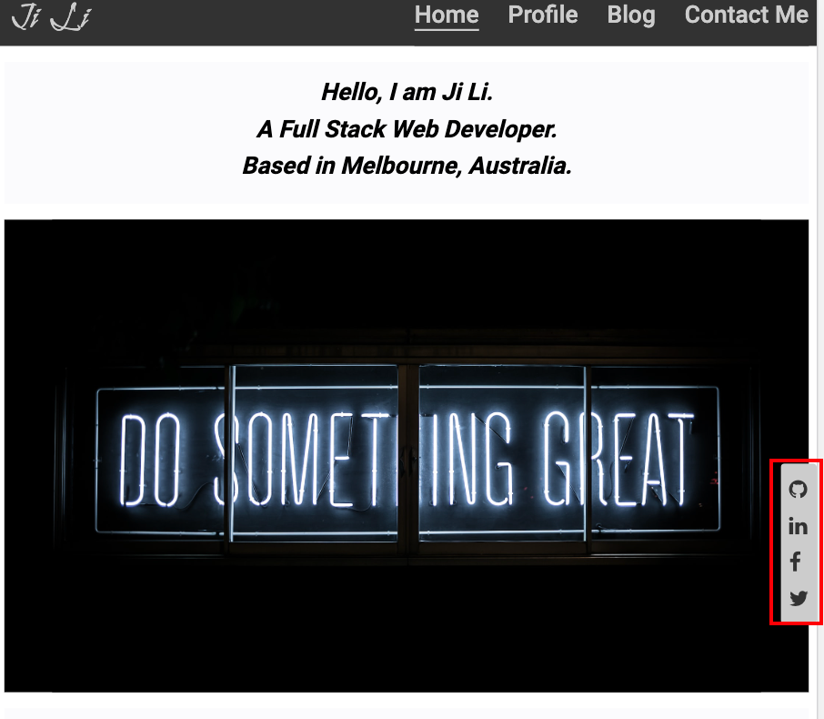
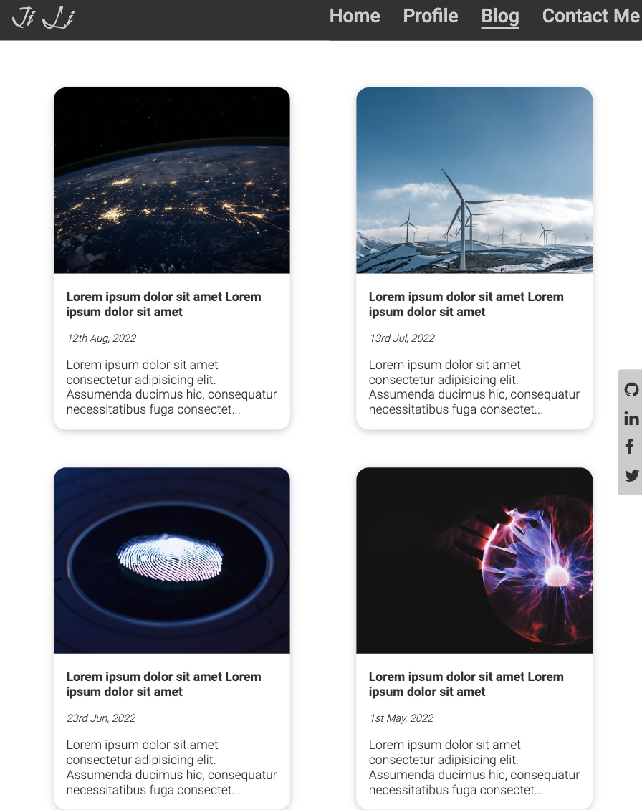
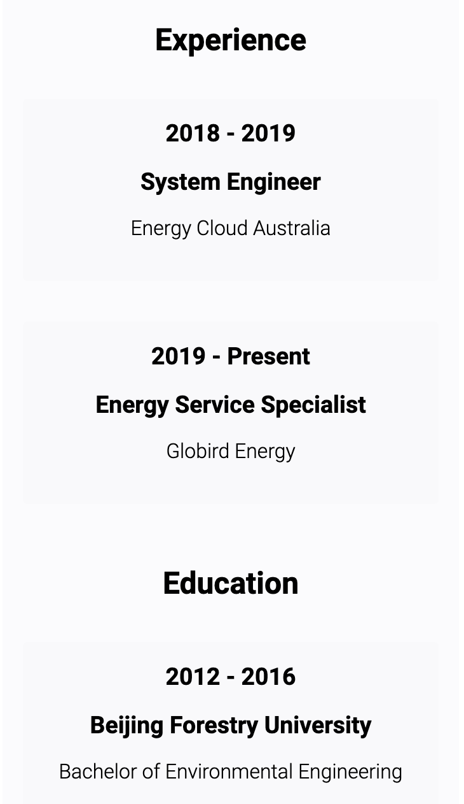
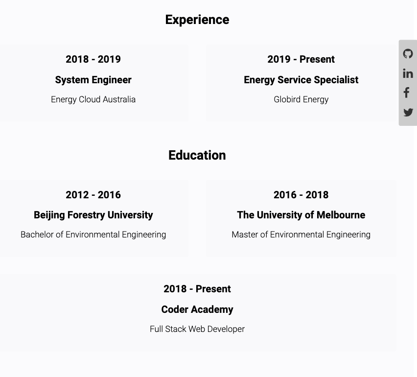
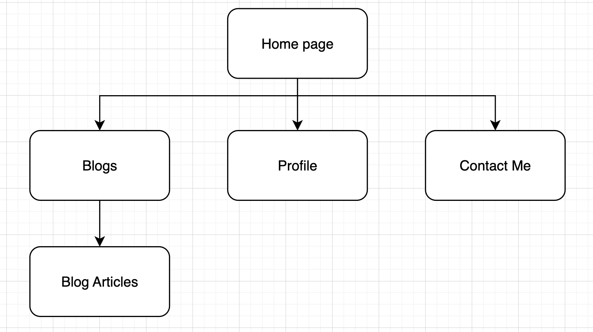

# Ji Li's Portfolio

## Portfolio URL
[Ji Li's Portfolio](https://ji-li-portfolio.netlify.app/)

## GitHub Repo
[JiLi_T1A2](https://github.com/JiLi94/JiLi_T1A2.git)

## Presentation Video
[Ji Li - Portfolio website design presentation](https://youtu.be/FMwmtBQZurI)

## Description of the portfolio website
### Purpose
The purpose is to create a portfolio website to demonstrate my web development skills, and introduce myself to potential employers that I am a self-motivated person with positive working attitudes, and equipped with various abilities, including technical knowledge in various industries such as information, engineering and energy sector. 

### Target audience
The target audience for the portfolio website is an employer looking to engage a dev and/or IT professional. And the employer has the following knowledge and expectations:

- technical knowledge relating to information technology, software development/coding, programming languages and development stacks

- high expectations of professionalism and a positive work ethic

### Functionality / features
- The website contains four main pages: home, profile, blog and contact me. Users can navigate through different pages using the nav bar on the top of the page. The logo of the website is also my name, and by clicking it the user can also return to the home page of the portfolio.
    - Home page: includes a simple introduction of myself and a 'read more' button. Users can click this button to go to the 'profile' page
    - Profile page: includes an introduction to my experiences and education and a link to download my resume
    - Blog page: includes 5 blog cards where user can click them and read the articles
    - Contact Me page: includes my personal contact details and a form in case anyone would like to message me via the website

- The website is based on a responsive and mobile-first design, and will respond and re-organise contents to different screen sizes to ensure the user can browse the website using different devices. See examples below:
    - The menus will be collapsed into a hamburger menu in small screens so the texts won't be overlapping with each other.
        - Navbar on phone:

            

        - Navbar on desktop:

            

    - The sidebar includes my social profiles and will be shown on every page in the website. Also, it will move to the bottom of the page on a smaller screen size so it won't block any content.
        - Sidebar on phone:
        
            

        - Sidebar on tablet:

            
    
    - The blog cards will wrap into one, two or three columns depending on the screen sizes.
        - Blog cards on phone:

            

        - Blog cards on tablet
          
            
    
    - On profile page, the experience and education cards will wrap depending on screen sizes.

        - Profile page on phone:

            
          
        - Profile page on tablet:

            

- All the buttons and cards (on profile page and blog page) on the website have animations when being hovered or clicked

### Sitemap

### Tech stack
This website was built with HTML5, CSS and JavaScript, and uses the following technologies:
- [SCSS](https://sass-lang.com/): for improving CSS logic and readability
- [Netlify](https://www.netlify.com/): for deploying the website
- [GitHub](https://github.com/): for git management
- [Figma](https://www.figma.com/): for wireframe development
- [Draw.io](https://app.diagrams.net/): for sitemap development

## Reference
1. Social media icons: [FontAwesome](https://fontawesome.com/v4/icons/)
2. Pictures: [Unsplash](https://unsplash.com/)
3. Fonts & hamburger menu icon: [Google Fonts](https://fonts.google.com/)
4. Resume template: [CoolFreeCV](https://www.coolfreecv.com/)
5. Web design inspirations: [Dribble](https://dribbble.com/) and [WiX](https://www.wix.com/)